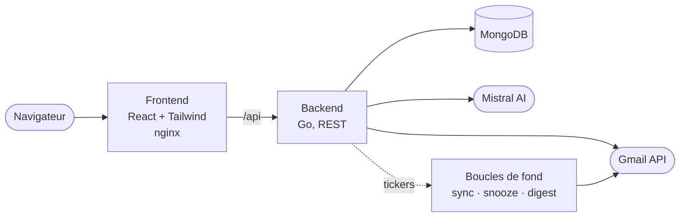

<div align="center">

# Mailsorter

**L'IA lit, comprend et range votre boîte Gmail à votre place.**

[Démo en ligne](https://mailsorter.sohbi.dev) · `Go` · `React + Tailwind` · `MongoDB` · `Mistral AI`


</div>

---

Une boîte Gmail qui déborde se vide de deux façons : à la main, pendant des heures, chaque semaine ; ou en déléguant la décision. Mailsorter délègue, mais sans jamais retirer la main à l'utilisateur : chaque action est proposée avec un score de confiance, réversible d'un clic, et journalisée.

L'application est en production sur [mailsorter.sohbi.dev](https://mailsorter.sohbi.dev), auto-hébergée de bout en bout.

## Ce qu'elle fait

**Trier.** L'IA analyse expéditeur, sujet et contenu, puis propose une action par email (archiver, supprimer, étiqueter, garder) avec un score de confiance. Vous validez au cas par cas, ou tout d'un geste.

**Ne pas passer par l'IA quand c'est inutile.** Un moteur de règles déterministes s'exécute en amont du modèle : conditions sur `from`, `subject`, `snippet`, `to`, `body` (contient, égal, regex, négations, plus vieux/récent que N jours) vers une ou plusieurs actions enchaînées. Gratuit, instantané, hors quota, et prévisualisable en dry-run avant tout changement.

**Couper le robinet.** Détection des newsletters via les en-têtes `List-Unsubscribe` (RFC 2369) et `List-Unsubscribe-Post` (RFC 8058), désabonnement exécuté côté serveur quand l'expéditeur le supporte, puis archivage du backlog de l'expéditeur dans le même geste.

**Tourner sans vous.** Synchronisation de fond, application automatique des règles à chaque synchro, report d'emails qui reviennent au bon moment, digest quotidien du tri des sept derniers jours envoyé dans votre propre boîte.

**Ne rien casser.** Une liste d'expéditeurs protégés qu'aucune passe automatisée ne peut archiver ni supprimer, un journal de toutes les actions avec un bouton Annuler qui rejoue l'inverse Gmail, et un export ou une suppression RGPD complète en un clic.

## Ce qui est intéressant dedans

Les décisions d'ingénierie qui valent le détour, avec leur point d'entrée dans le code.

| | |
|---|---|
| **Le moteur de règles est pur** | `internal/rules` ne fait aucune I/O : il prend des emails et des règles, il rend des décisions. Le dry-run (`rules.Preview`) réutilise exactement le chemin de `ApplyRules`, donc l'aperçu ne peut pas mentir sur ce que fera l'application réelle. |
| **L'IA coûte cher, on l'évite** | Cache d'analyses indexé sur `sha256(from\|subject)` et **partagé entre tous les utilisateurs** : un email déjà vu par quelqu'un d'autre ne repasse jamais par le modèle. Les appels restants partent par lots de 8, avec repli automatique par email si la réponse ne s'aligne pas. |
| **Un 429 ne doit pas ruiner un lot** | Le client Mistral réessaie les erreurs transitoires avec backoff exponentiel et jitter, en honorant `Retry-After` et plafonné pour rester dans les timeouts serveur. Les 4xx échouent vite. |
| **Pas de dépendance d'authentification** | Le token de session est un HMAC-SHA256 maison, expirant, signé avec une clé dérivée du secret maître par un label distinct de celle du `state` OAuth : un token de session ne peut pas être rejoué comme state, ni l'inverse. Le middleware supprime systématiquement l'en-tête `X-User-Email` fourni par le client avant de le reposer lui-même. |
| **Un seul catalogue de données** | `internal/account` déclare une fois la liste des collections détenues par un utilisateur, et cette liste pilote **à la fois** l'export et la suppression RGPD. Impossible d'exporter une donnée qu'on ne sait pas effacer, ou d'effacer une donnée qu'on n'a jamais divulguée. |
| **Le digest part de votre compte** | Aucun SMTP, aucun service tiers : le récap quotidien est envoyé via l'API Gmail de l'utilisateur lui-même, avec le scope `gmail.send`. |
| **Les identifiants OAuth ne sont pas une donnée applicative** | Une seule application OAuth sert toute l'instance, donc elle vit dans l'environnement du déploiement et n'a aucune surface HTTP : ni lecture, ni écriture, ni écran. |

## Architecture



| Brique | Stack | Rôle |
| --- | --- | --- |
| Frontend | React 18, Tailwind, Axios | Cockpit de tri, design system maison, zéro librairie d'icônes |
| Backend | Go 1.21+, Gorilla Mux, OAuth2 | API REST, orchestration IA, accès Gmail, ordonnanceurs |
| Base | MongoDB 7 | Comptes, suggestions, règles, journal d'actions |
| IA | Mistral AI | Classification des emails |

Détail : [`docs/ARCHITECTURE.md`](docs/ARCHITECTURE.md) · API complète : [`docs/API.md`](docs/API.md) · Historique des phases : [`docs/ROADMAP.md`](docs/ROADMAP.md)

## Démarrage

Prérequis : Docker et Docker Compose, un identifiant OAuth 2.0 Google avec l'API Gmail activée, une clé Mistral AI.

```bash
git clone https://github.com/nohe-sohbi/Mailsorter.git
cd Mailsorter
cp .env.example .env
```

Renseignez au minimum :

```env
ENCRYPTION_KEY=une-chaine-aleatoire-de-32-caracteres-minimum
MISTRAL_API_KEY=votre_cle_mistral
GMAIL_CLIENT_ID=votre_client_id.apps.googleusercontent.com
GMAIL_CLIENT_SECRET=votre_client_secret
GMAIL_REDIRECT_URL=http://localhost:3000/auth/callback
```

Les identifiants Gmail sont une **configuration d'instance** : une seule application OAuth sert tous les comptes, elle se renseigne uniquement ici, et `GMAIL_REDIRECT_URL` doit correspondre exactement à un URI de redirection autorisé dans le projet Google Cloud. Le client OAuth doit être de type **Application Web** ; un client Desktop n'autorise que localhost en redirection.

```bash
docker compose up -d     # ou : make up
```

| Surface | URL |
| --- | --- |
| Application | http://localhost:3000 |
| API | http://localhost:8080 |
| Santé | http://localhost:8080/health |

## Développement

```bash
cd backend  && go run cmd/server/main.go
cd frontend && npm install && npm start
cd backend  && go test ./... -race      # la suite complète
```

La CI (`.github/workflows/ci.yml`) joue `vet`, `build` et `test -race` sur le backend, et le build du frontend, à chaque push et chaque PR.

## API en un coup d'œil

| Méthode | Endpoint | Description |
| --- | --- | --- |
| `GET` | `/api/emails` | Liste paginée de la boîte (sans les corps) |
| `GET` | `/api/emails/{id}` | Un message avec son corps décodé et ses pièces jointes |
| `POST` | `/api/emails/action` | Action directe sur un message |
| `POST` | `/api/emails/batch-action` · `/batch-undo` | Une action sur toute une sélection, et sa réversion |
| `POST` | `/api/emails/snooze` | Reporte un email, qui revient tout seul |
| `POST` | `/api/ai/analyze` | Suggestions de tri (cache + batch) |
| `POST` | `/api/ai/analyze-async` | Job d'analyse non bloquant, avec progression |
| `POST` | `/api/ai/apply-batch` | Applique N suggestions en une requête |
| `GET` | `/api/rules` · `POST` `/api/rules/preview` | Règles déterministes et leur dry-run |
| `GET` | `/api/subscriptions` · `POST` `/api/unsubscribe` | Newsletters détectées, désabonnement |
| `GET` | `/api/activity/log` · `POST` `/api/activity/undo` | Journal des actions et annulation |
| `GET` | `/api/account/export` · `DELETE` `/api/account` | Export et suppression RGPD |
| `GET` | `/health` · `/metrics` | Ping MongoDB, build, uptime, compteurs |

Les 43 routes et leurs charges utiles : [`docs/API.md`](docs/API.md).

## Licence

MIT
