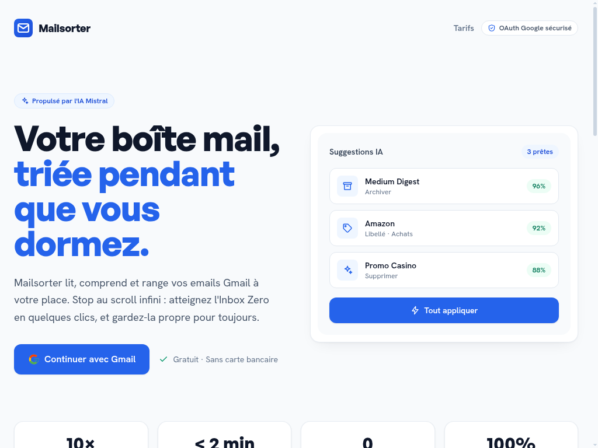
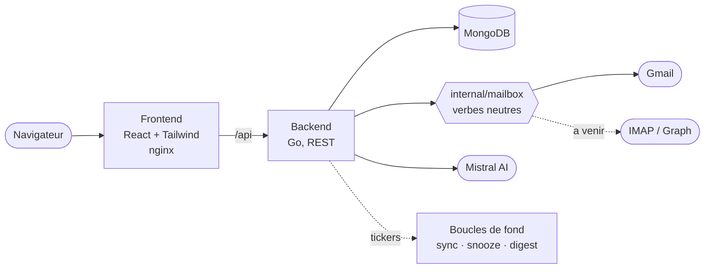

<div align="center">

# Mailsorter

**L'IA lit, comprend et range votre boîte mail à votre place.**

[Service géré](https://mailsorter.sohbi.dev) · `Go` · `React + Tailwind` · `MongoDB` · `Mistral AI` · MIT



</div>

---

Une boîte qui déborde se vide de deux façons : à la main, pendant des heures, chaque semaine ; ou en déléguant la décision. Mailsorter délègue, mais sans jamais retirer la main à l'utilisateur : chaque action est proposée avec un score de confiance, réversible d'un clic, et journalisée.

**Mailsorter s'installe chez vous.** Vous clonez, vous lancez, vos identifiants et vos emails ne quittent pas votre machine. C'est la façon recommandée de l'utiliser, et c'est aussi la seule qui donne accès à l'API Gmail complète et à Proton.

## Deux éditions

Ce n'est pas une question d'emballage : l'édition décide de ce que l'instance peut atteindre.

| | Auto-hébergée | Service géré |
|---|---|---|
| | `EDITION=self-hosted` | `EDITION=hosted` |
| **Qui l'exploite** | Vous | Nous |
| **Prix** | Gratuit, MIT | Payant, par boîte |
| **Gmail** | **API complète**, avec votre propre projet Google Cloud | IMAP + mot de passe d'application |
| **Proton** | Oui, via Bridge local | Impossible |
| **Clé IA** | La vôtre | Incluse |
| **Vos identifiants** | Restent chez vous | Chez nous, chiffrés |

Sur Gmail, l'auto-hébergée est **strictement meilleure** : un projet Google Cloud personnel vous place dans l'exemption d'usage personnel de Google, donc aucune vérification, aucun audit, aucun plafond. Le service géré ne peut pas faire ça : un client OAuth partagé est plafonné par Google à 100 autorisations pour la durée de vie du projet, et ce plafond n'est pas réinitialisable.

Ce qui se paie dans le service géré, ce n'est donc pas la fonctionnalité, c'est de ne pas avoir à s'en occuper.

## Fournisseurs

Seize fournisseurs, dix-huit routes. Le catalogue vit dans [`backend/internal/provider`](backend/internal/provider/catalog.go) et l'application ne propose jamais un fournisseur que son édition ne sait pas joindre.

**Dans les deux éditions.** Outlook.com et Microsoft 365 (OAuth, un bouton, aucun plafond), Gmail et Google Workspace (IMAP + mot de passe d'application), Orange, La Poste, Free, SFR, Yahoo, AOL, iCloud, Fastmail, Zoho, OVH, Infomaniak, et tout serveur IMAP, y compris auto-hébergé.

**Auto-hébergée uniquement.** Gmail et Workspace par l'API complète, et Proton Mail via Bridge.

Sur Gmail, l'IMAP ne dégrade presque rien : les extensions `X-GM-EXT-1` conservent les libellés, la syntaxe de recherche Gmail et un identifiant de message stable.

## Ce qu'elle fait

**Trier.** L'IA analyse expéditeur, sujet et extrait, puis propose une action par email (archiver, supprimer, étiqueter, garder) avec un score de confiance. Vous validez au cas par cas, ou tout d'un geste.

**Ne pas passer par l'IA quand c'est inutile.** Un moteur de règles déterministes s'exécute en amont du modèle : conditions sur `from`, `subject`, `snippet`, `to`, `body` (contient, égal, regex, négations, plus vieux ou récent que N jours) vers une ou plusieurs actions enchaînées. Gratuit, instantané, hors quota, et prévisualisable en dry-run avant tout changement.

**Couper le robinet.** Détection des newsletters via les en-têtes `List-Unsubscribe` (RFC 2369) et `List-Unsubscribe-Post` (RFC 8058), désabonnement exécuté côté serveur quand l'expéditeur le supporte, puis archivage du backlog de l'expéditeur dans le même geste.

**Tourner sans vous.** Synchronisation de fond, application automatique des règles à chaque synchro, report d'emails qui reviennent au bon moment, digest quotidien du tri des sept derniers jours envoyé dans votre propre boîte.

**Ne rien casser.** Une liste d'expéditeurs protégés qu'aucune passe automatisée ne peut archiver ni supprimer, un journal de toutes les actions avec un bouton Annuler qui rejoue l'action inverse, et un export ou une suppression RGPD complète en un clic.

## Installation

Prérequis : Docker et Docker Compose. Pour l'IA, une clé [Mistral](https://console.mistral.ai/).

```bash
git clone https://github.com/nohe-sohbi/Mailsorter.git
cd Mailsorter
cp .env.example .env
```

Renseignez au minimum :

```env
EDITION=self-hosted
ENCRYPTION_KEY=une-chaine-aleatoire-de-32-caracteres-minimum
MISTRAL_API_KEY=votre_cle_mistral
```

Générez une vraie clé de chiffrement, par exemple avec `openssl rand -base64 32`. **Le serveur refuse de démarrer sur la valeur d'exemple**, et changer cette clé plus tard déconnecte tout le monde et rend illisibles les jetons stockés.

```bash
make up
```

| Surface | URL |
| --- | --- |
| Application | http://localhost:3000 |
| API | http://localhost:8080 |
| Santé | http://localhost:8080/health |

`make up` empile `docker-compose.yml` et `compose.local.yml`, ce second fichier publiant les ports sur l'hôte. Un `docker compose up` seul démarre la pile sans rien exposer : le fichier principal est celui du déploiement, où le routage passe par un proxy.

### Connecter Gmail par l'API

Pour la pleine fidélité sur Gmail, créez **votre propre** projet Google Cloud. Vous en êtes l'unique utilisateur, ce qui vous place dans l'exemption d'usage personnel : ni vérification, ni audit de sécurité, ni plafond.

1. Créez un projet sur [console.cloud.google.com](https://console.cloud.google.com/), activez l'API Gmail.
2. Configurez l'écran de consentement, puis **cliquez sur Publier l'application**. Sans ce clic vous restez en mode Test et votre autorisation expire tous les sept jours.
3. Créez un identifiant OAuth de type **Application Web** (pas Desktop) avec `http://localhost:3000/auth/callback` en URI de redirection.
4. Reportez l'identifiant et le secret dans votre `.env` :

```env
GMAIL_CLIENT_ID=votre_client_id.apps.googleusercontent.com
GMAIL_CLIENT_SECRET=votre_client_secret
GMAIL_REDIRECT_URL=http://localhost:3000/auth/callback
```

Un écran d'avertissement Google apparaît à la connexion : c'est normal, vous consentez à une application que vous avez créée vous-même.

### Connecter un autre fournisseur

Les autres fournisseurs demandent un identifiant que vous générez chez eux, jamais le mot de passe de votre compte. L'application vous indique lequel et où le trouver, depuis le même catalogue que celui avec lequel elle se connecte.

## Ce qui est intéressant dedans

Les décisions d'ingénierie qui valent le détour, avec leur point d'entrée dans le code.

| | |
|---|---|
| **Le moteur de règles est pur** | [`internal/rules`](backend/internal/rules) ne fait aucune I/O : il prend des emails et des règles, il rend des décisions. Le dry-run réutilise exactement le chemin de l'application réelle, donc l'aperçu ne peut pas mentir sur ce qui va se passer. |
| **Aucun gestionnaire ne connaît Gmail** | [`internal/mailbox`](backend/internal/mailbox/mailbox.go) tient le vocabulaire neutre des actions et sa traduction par transport. Les libellés système de Gmail apparaissaient 51 fois dans l'arbre ; ils vivent maintenant dans un seul fichier. Ajouter l'IMAP, c'est ajouter une fonction de traduction. |
| **L'édition est une donnée, pas un commentaire** | [`internal/provider`](backend/internal/provider/catalog.go) déclare quelle route est offerte dans quelle édition, et un test refuse que l'API Gmail apparaisse un jour côté hébergé. C'est le genre de règle qu'on redécouvre autrement au 101e utilisateur. |
| **L'IA coûte cher, on l'évite** | Cache d'analyses indexé sur `sha256(from\|subject)` et **partagé entre tous les utilisateurs** : un email déjà vu par quelqu'un d'autre ne repasse jamais par le modèle. Les appels restants partent par lots de 8, avec repli automatique par email si la réponse ne s'aligne pas. |
| **Un 429 ne doit pas ruiner un lot** | Les clients Mistral et Gmail réessaient les erreurs transitoires avec backoff exponentiel et jitter, en honorant `Retry-After` et plafonnés pour rester dans les timeouts serveur. Les 4xx échouent vite. |
| **Pas de dépendance d'authentification** | Le token de session est un HMAC-SHA256 maison, expirant, signé avec une clé dérivée du secret maître par un label distinct de celle du `state` OAuth : un token de session ne peut pas être rejoué comme state. Le middleware supprime systématiquement l'en-tête `X-User-Email` fourni par le client avant de le reposer lui-même. |
| **Les jetons ne dorment pas en clair** | Les identifiants Google sont scellés en AES-256-GCM avant d'atteindre la base, avec une migration qui rescelle les anciennes valeurs à la première lecture. Une valeur illisible devient un 401 qui relance la connexion, jamais un 500. |
| **Un seul catalogue de données** | [`internal/account`](backend/internal/account/account.go) déclare une fois la liste des collections détenues par un utilisateur, et cette liste pilote **à la fois** l'export et la suppression RGPD. Impossible d'exporter une donnée qu'on ne sait pas effacer, ou d'effacer une donnée qu'on n'a jamais divulguée. |
| **Le digest part de votre compte** | Aucun SMTP tiers : le récap quotidien est envoyé via le compte de l'utilisateur lui-même. |

## Architecture



| Brique | Stack | Rôle |
| --- | --- | --- |
| Frontend | React 18, Tailwind, Axios | Cockpit de tri, design system maison, zéro librairie d'icônes |
| Backend | Go 1.21+, Gorilla Mux, OAuth2 | API REST, orchestration IA, accès aux boîtes, ordonnanceurs |
| Base | MongoDB 7 | Comptes, suggestions, règles, journal d'actions |
| IA | Mistral AI | Classification des emails |

Détail : [`docs/ARCHITECTURE.md`](docs/ARCHITECTURE.md) · API complète : [`docs/API.md`](docs/API.md) · Historique des phases : [`docs/ROADMAP.md`](docs/ROADMAP.md)

## Développement

```bash
cd backend  && go run cmd/server/main.go
cd frontend && npm install && npm start
cd backend  && go test -race ./...      # la suite complète, 205 tests
```

La CI (`.github/workflows/ci.yml`) joue `vet`, `build` et `test -race` sur le backend, et le build du frontend, à chaque push et chaque PR.

La carte du dépôt, les conventions et les pièges connus : [`CLAUDE.md`](CLAUDE.md).

## API en un coup d'œil

| Méthode | Endpoint | Description |
| --- | --- | --- |
| `GET` | `/api/providers` | Les fournisseurs joignables par cette édition |
| `GET` | `/api/emails` | Liste paginée de la boîte (sans les corps) |
| `GET` | `/api/emails/{id}` | Un message avec son corps décodé et ses pièces jointes |
| `POST` | `/api/emails/action` | Action directe sur un message |
| `POST` | `/api/emails/batch-action` · `/batch-undo` | Une action sur toute une sélection, et sa réversion |
| `POST` | `/api/emails/snooze` | Reporte un email, qui revient tout seul |
| `POST` | `/api/ai/analyze` | Suggestions de tri (cache + batch) |
| `POST` | `/api/ai/analyze-async` | Job d'analyse non bloquant, avec progression |
| `GET` | `/api/rules` · `POST` `/api/rules/preview` | Règles déterministes et leur dry-run |
| `GET` | `/api/subscriptions` · `POST` `/api/unsubscribe` | Newsletters détectées, désabonnement |
| `GET` | `/api/activity/log` · `POST` `/api/activity/undo` | Journal des actions et annulation |
| `GET` | `/api/account/export` · `DELETE` `/api/account` | Export et suppression RGPD |
| `GET` | `/health` · `/metrics` | Ping MongoDB, build, uptime, compteurs |

Les 70 routes et leurs charges utiles : [`docs/API.md`](docs/API.md).

## Licence

MIT. Faites-en ce que vous voulez.
